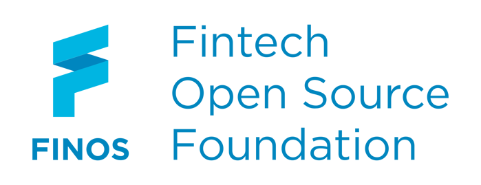
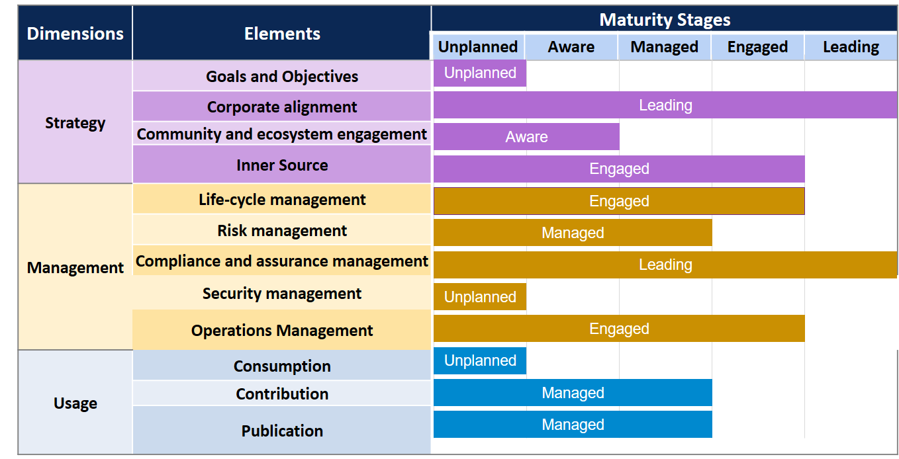

<!--
SPDX-FileCopyrightText: 2021 Wipro, Ltd.

SPDX-License-Identifier: CC-BY-SA-4.0
 -->
# Open Source Maturity Model

This repository contains documentation, scripts, and data files related to the Open Source Maturity Model. 

The model is itself an open source project and is free to use, study, improve, and redistribute according to the license requirements.

## What is the Open Source Maturity Model?

The Open Source Maturity Model (OSMM) allows you to understand where your organization is on its open source journey.

By answering a series of questions, the OSMM framework evaluates your organization's open source maturity, providing a snapshot of its current stage. This stage is based on your organization's current culture, policies, processes, practices, and resources.

The model defines the benefits of open source across three dimensions:

1. Strategy
2. Managmement
3. Usage

Every organization will be at different stages of maturity across these dimensions. The OSMM creates an organizational baseline that you can use to define and achieve the ideal target state that works best for _your_ organization.

## What you'll find in this repository

The project contains three primary parts:

1. [User documentation](./docs/user/): Definitions and explanations for everything in the OSMM, as well as guidance for how to use OSMM output to help develop a plan for next steps for your organization
1. [Admin documentation](./docs/admin/): How to operate your own instance of the OSMM, including details about how the model generates its output
1. [OSMM data files](./data): Files for import into [LimeSurvey](http://limesurvey.org). These files contain all of the questions and associated data that's used by the OSMM to generate its output. The files also include the scripts necessary for creating the charts included with the output.

## How to use the OSMM

Please see the [documentation website](https://finos.github.org/osmm) for complete instructions for using and operating the OSMM.

## Contributing to the OSMM

Our [Contributors Guide](./CONTRIBUTING.md) details how to get answers to your OSMM questions, where and how to report bugs and feature requests, and how to participate in the community.

## Governance
This blueprint implements https://github.com/finos/community/tree/master/governance#open-source-software-projects

## Licensing

All data and documentation for the Open Source Maturity Model is licensed under the [Creative Commons Attribution-Sharealike 4.0 International](./LICENSES/CC-BY-SA-4.0.txt) license.

Please see the [LICENSES](./LICENSES/) directory for the complete text for the project license(s).

## Attribution

The initial version of the Open Source Maturity Model was developed by and contributed to FINOS by [Wipro Limited](https://www.wipro.com/open-source/).
