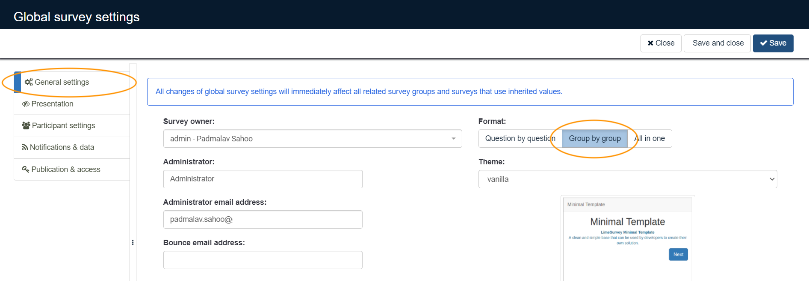
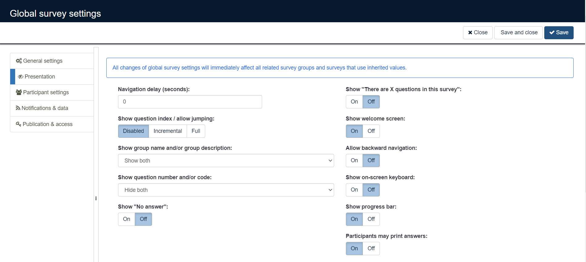
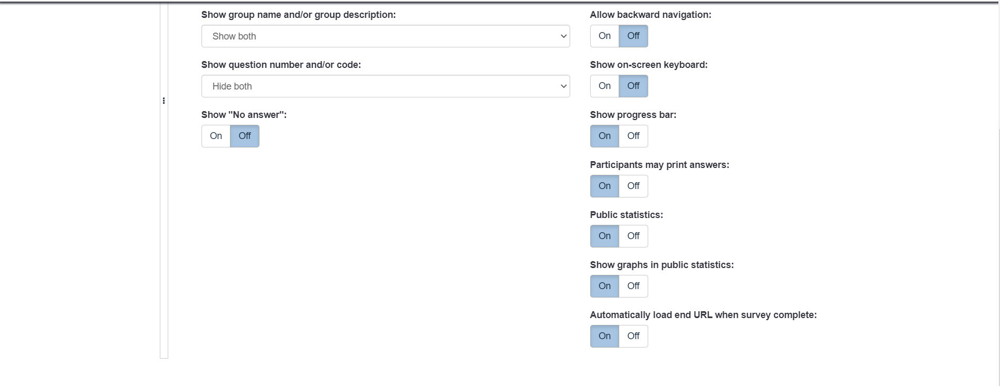
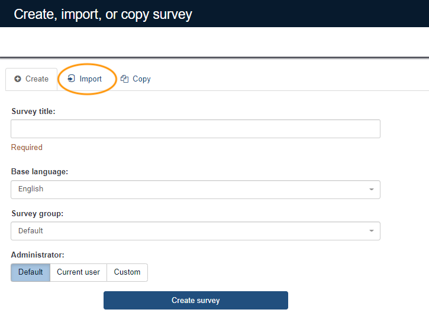
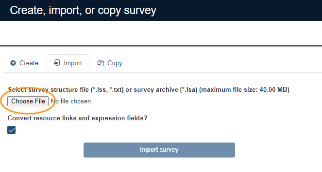
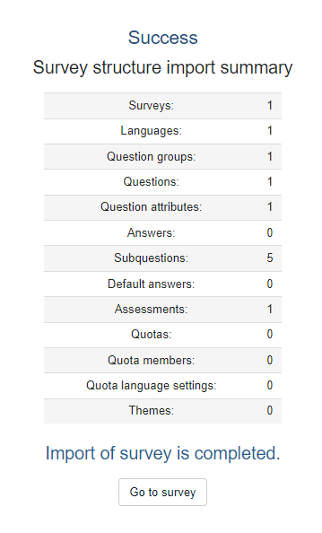

<!--
SPDX-FileCopyrightText: 2021 Wipro, Ltd.

SPDX-License-Identifier: CC-BY-SA-4.0
 -->
 > ⚠️ This document assumes you've already successfully installed the Community Edition of LimeSurvey. If you haven't completed this step yet, please [follow the directions provided by LimeSurvey](https://manual.limesurvey.org/Installation_-_LimeSurvey_CE).

## Configure LimeSurvey to prepare for file import

A small amount of preparation is required before importing the OSMM survey structure file.

|    |    |
|----|----|
| On the **Global settings** screen in the LimeSurvey admin interface, select **General settings** from the left sidebar and then **Group by group** under the "Format:" option.  |  |
| Next, select **Presentation** from the left sidebar and confirm that the options are set to these values:<ul> <li>Navigation delay (seconds): 0</li> <li>Show question index/allow jumping: Disabled</li> <li>Show group name and/or group description: Show both</li> <li>Show question number and/or code: Hide both</li> <li>Show "No answer": Off</li> <li>Show "There are X questions in this survey": Off</li> <li>Show welcome screen: On</li> <li>Allow backward navigation: Off</li> <li>Show on-screen keyboard: Off</li> <li>Show progress bar: On</li> <li>Participants may print answers: On</li> <li>Public statistics: On</li> <li>Show graphs in public statistics: On</li> <li>Automatically load end URL when survey complete: On</li> </ul> | <!--  --> |

## Import the OSMM survey structure file

The next step is to import the OSMM survey structure file. This will create the OSMM survey in the LimeSurvey system.

|    |    |
|----|----|
| Save the OSMM survey structure file to your local system. It's located in the `data` folder in the OSMM GitHub repository. | |
| At the top of the Admin panel, click the **+ Create Survey** link.  |  |
| Select the **Import** option on the Create, import, or copy survey display |  |
| Select **Choose file**, navigate to where you saved the survey structure file on your local system, select that file, select the **Convert resource links and expression fields?** option, then click **Import survey**. |  |
| The survey will not take long to import. Once it's complete, you'll see the import survey summary success report. |  |

## Apply the spider chart patches

> ⚠️ This part of the document assumes that the reader has write access (command line, SFTP, etc.) to the machine where LimeSurvey is installed.

The software that generates the spider chart is custom development for the OSMM project, not a standard feature of LimeSurvey. This custom development ("patch") must be installed manually.

The patch files are located in the `code` folder in the OSMM GitHub repository. 

**BACK UP THE FILES.** Most of the patch files are replacements for existing files in the LimeSurvey installation. They will overwrite the existing files. Prior to moving these files into place, you may wish to back them up to a safe location in case something goes wrong with your installation.

Copy these files to the appropriate locations on your LimeSurvey installation. The file hierarchy in the `code` folder matches that of the LimeSurvey installation. Therefore each patch file should be placed in the same hierarchy on your installation. For instance, the `code/limesurvey/application/views/admin/export/statistics_user_view.php` file from the GitHub repository should be placed in the `limesurvey/application/views/admin/export` directory in your LimeSurvey installation.

Here is a complete list of files, along with their destination paths in your LimeSurvey installation. Replacement files are denoted by a purple circle 🟣 and new files by a yellow square 🟨.

* 🟣 /limesurvey/application/views/admin/export/statistics_user_view.php
* 🟣 /limesurvey/application/helpers/common_helper.php
* 🟣 /limesurvey/application/controllers/admin/statistics.php
* 🟣 /limesurvey/application/helpers/admin/statistics_helper.php
* 🟣 /limesurvey/application/controllers/PrintanswersController.php
* 🟣 /limesurvey/themes/survey/vanilla/views/subviews/printanswers/printanswers_table.twig
* 🟨 /limesurvey/application/views/admin/export/generatestats/simplestats/_statisticsoutput_aggregate_graphs.php
* 🟨 /limesurvey/application/views/admin/export/generatestats/simplestats/_statisticsoutput_aggregate_bar_graphs.php

The graphical visulization of output is customized using 2 different javascript chart libraries, those are ChartJS and ApexChart libraries and the corresponding libraries are available under:
* 🟨 /limesurvey/assets/scripts/admin/dist* 
* 🟣 /limesurvey/assets/scripts/admin/Chart.min.js
These need to be copied to respective directory during installation.

The maturity stage definitions are linked to the heatmap shown on the graphical output page. These are set of html files need to be copied under /limesurvey/ directory.

* 🟨 /limesurvey/*.html

## Cautionary notes about modifying the survey

Some portions of the survey setup are required for OSMM operations:

* The OSMM survey relies upon the `question_no` field and the `question_type` value assigned to each question.
* Some of the survey expressions are required for the aggregation of values at the element and dimension level.

Modifying these can (likely will) have unexpected side-effects on the survey results, including incorrect or invalid results or metrics. 

**BACK UP THE SURVEY.** Before modifying the survey, please make sure either to have the survey structure file handy in case a re-import is required or export the survey structure as a backup file.
