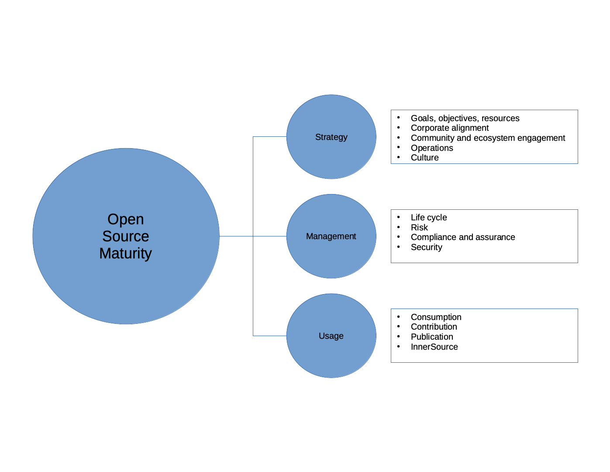

<!--
SPDX-FileCopyrightText: 2021 Wipro, Ltd.

SPDX-License-Identifier: CC-BY-SA-4.0
 -->
## OSMM Survey Process and Weighting Model

The online survey is organized to provide a brief overview of the survey dimensions and elements at start, followed by general information page for the user to provide his/her details and the set of questions following general information section. The OSMM online survey is a set of questions grouped into, as per the element definitions. Each group/element consists of five questions, combination of both mandatory and optional questions. The survey will be displayed element-wise to the user while taking the survey. So, there will be a total of 65 questions from all elements in the online survey for the user to answer.



The OSMM online survey consists of two sets of questions with respect to its significance, namely quantitative and qualitative questions. The quantitative questions are associated with a weight for each option the respondent chooses, in addition the role of the respondent may add an additional weightage to certain elements while he/she is answering e.g., if the respondent's role is "Architect" the weight for element "Goals, Objectives and Resources" is twice than that of a "Legal" role.

For example, For user role as "Architect" answering "Goals, Objectives and Resources" element, the cumulative weight of the five questions may be: 

```
=> Q1+Q2+Q3+Q4+Q5 = 1+2+0+1+1 = 5
```

Final weight of the response for the role of "Architect":

```
=> Total score * Role weightage of Architect

=> 5*2 = 10
```

For a role of "CXO" it would be multiple of 3, so final weight would be 15 for the same set of answers.

The qualitative questions are to provide additional information to the survey, which helps the survey admin to consider the various comments to analyse post the survey is completed. These questions are mostly optional questions.


