<!--
SPDX-FileCopyrightText: 2021 Wipro, Ltd.

SPDX-License-Identifier: CC-BY-SA-4.0
 -->
As a survey administrator, you can view spider charts of the aggregated survey results at any time.

There are two ways to locate these charts in the admin panel:

### Via the Statistics option in the side menu

|    |    |
|----|----|
| Click the “**Statistics**” link on the panel from the Settings panel: | 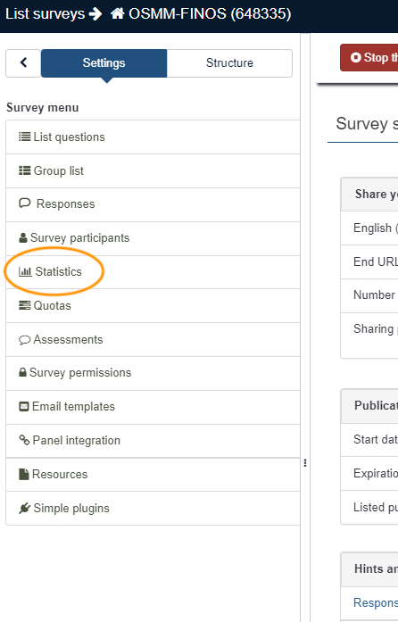 |
| Click on the “Simple mode” from the top menu as highlighted: | 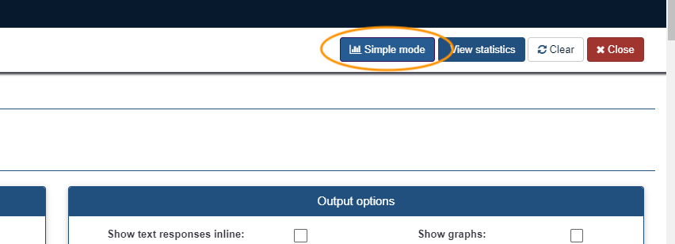 |
| Click on the “Aggregate only” option from the Include dropdown list | 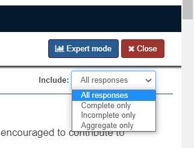 |

### Via the Responses dropdown menu in the top panel

|   |   |
|---|---|
| Click the “**Responses**” from the top panel and the“**Responses & statistics**”. | 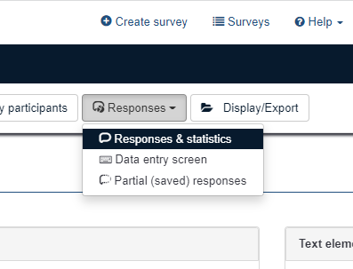 |
| Click on the “**Statistics**” button to reach Statistics page: | 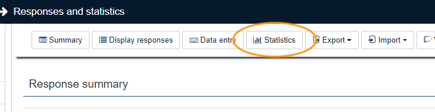 |
| Click on “**Simple mode**”, then  select “**Aggregate only**” dropdown on Statistics page: | 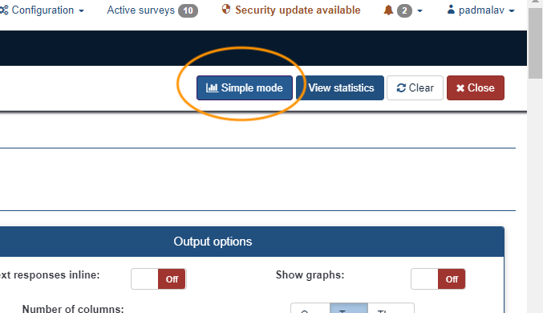 |
| | 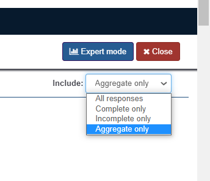 |

### Example spider charts

There are four possible aggregate-level spider charts.

* One chart for each of the three dimensions, with their respective elements represented by the axes
* One chart summarizing the overall maturity across all three dimensions

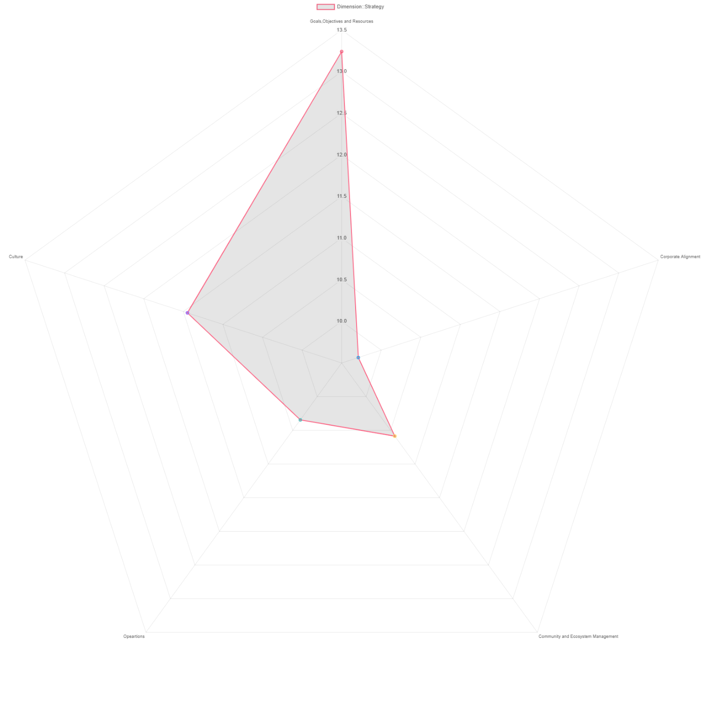

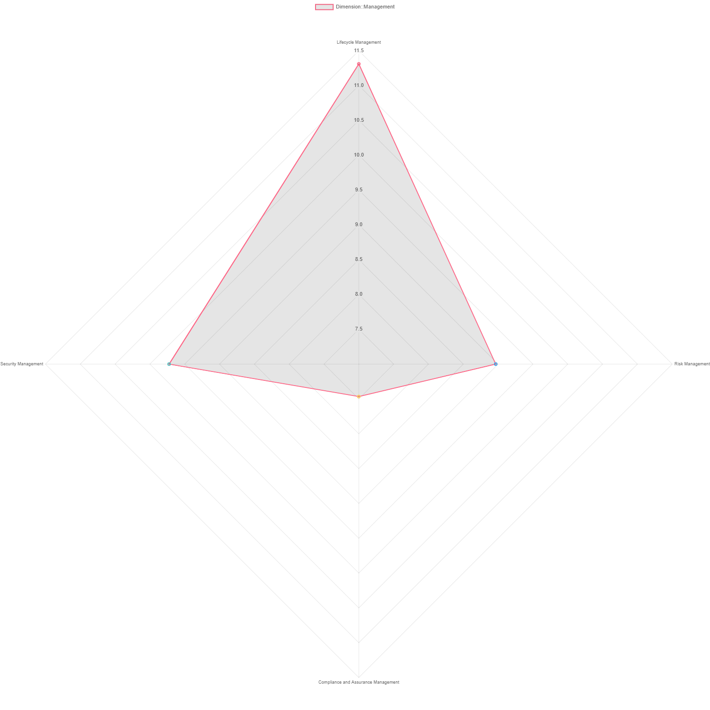

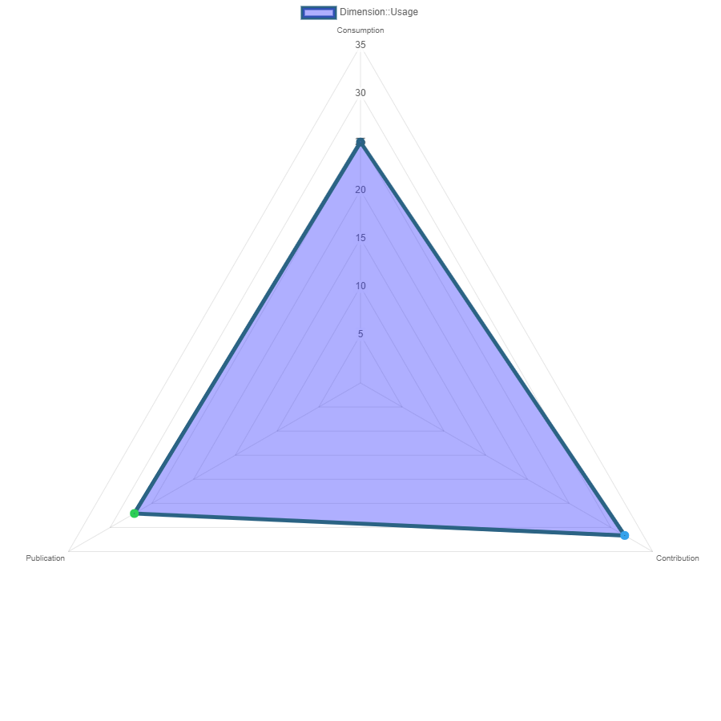

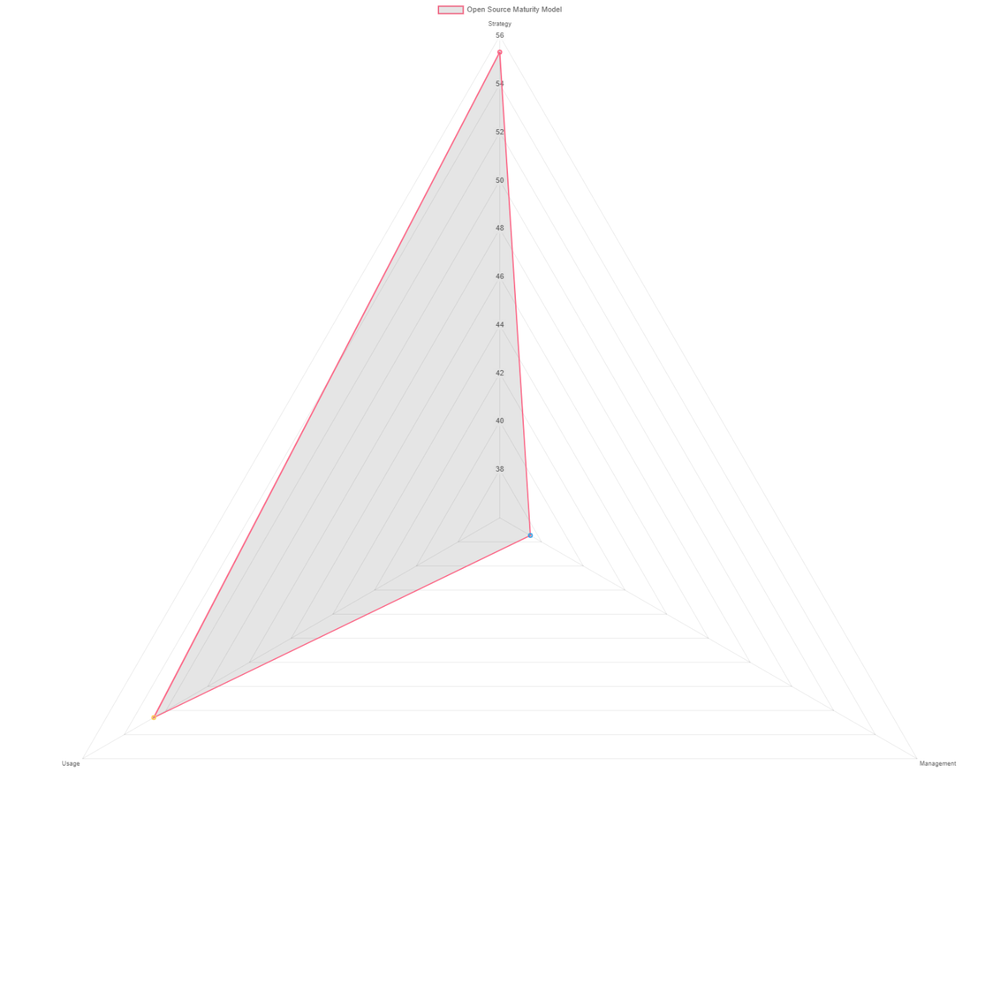
